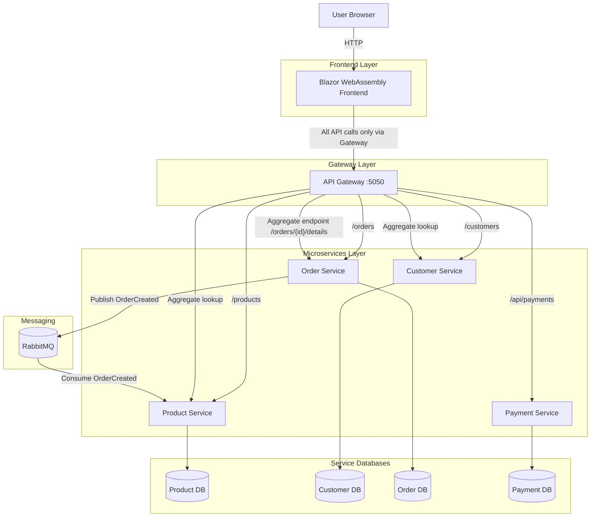
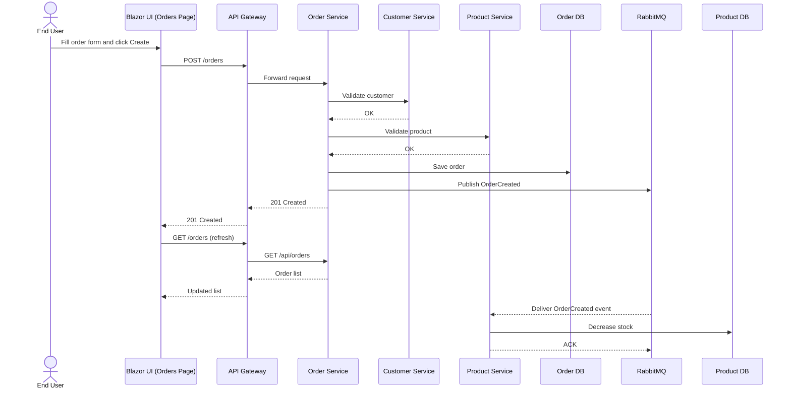

# fdu-CSCI6844-project

Containerized full-stack eCommerce system using Blazor WebAssembly, ASP.NET Core microservices, EF Core, SQLite, RabbitMQ, and an API Gateway (YARP).

## Introduction

This project implements a distributed full-stack application with a strict edge architecture:

- Frontend clients talk only to the API Gateway.
- Internal microservices are hidden behind Docker networking.
- Service-to-service asynchronous workflows are handled via RabbitMQ.

The UI supports core workflows for products, customers, and orders. The backend is decomposed into domain services (Product, Customer, Order, Payment) with service-owned databases.

## Architecture

- Frontend (Blazor WASM via Nginx): `http://localhost:8081`
- API Gateway (single public API entry point): `http://localhost:5050`
- Internal services (not exposed to host):
  - `customerservice`
  - `productservice`
  - `orderservice`
  - `paymentservice`
- Messaging broker (internal only):
  - `rabbitmq` on Docker network port `5672`

### Key Rule

Frontend must never call microservices directly. All browser API calls must go through the API Gateway.

### Mermaid Architecture Diagram



## Frontend Overview

Implemented pages:

- Home
- Products: view all products + add product form
- Customers: view all customers + add customer form
- Orders: create order + view all orders

Frontend integration pattern:

- Uses a centralized `ApiService` for HTTP calls.
- Uses DTOs in `Frontend/Models` (no backend domain entity exposure).
- Configures one `HttpClient` base address to the gateway in `Frontend/Program.cs`.

## Project Documentation

- Root overview: this file
- Final report: [docs/Final-Project-Report.md](docs/Final-Project-Report.md)
- ApiGateway: [ApiGateway](ApiGateway)
- CustomerService: [CustomerService/README.md](CustomerService/README.md)
- ProductService: [ProductService/README.md](ProductService/README.md)
- OrderService: [OrderService/README.md](OrderService/README.md)
- PaymentService: [PaymentService/README.md](PaymentService/README.md)

## Run with Docker

From project root:

```bash
docker compose up --build -d
docker compose ps
```

Verify key public endpoints:

```bash
# Frontend
curl -I http://localhost:8081

# Gateway
curl -I http://localhost:5050/swagger/index.html
```

Stop services:

```bash
docker compose down
```

## Gateway Swagger

- Gateway Swagger UI: http://localhost:5050/swagger/index.html

## Gateway Routes

- Public routes (recommended for frontend):
  - `GET/POST http://localhost:5050/products`
  - `GET/POST http://localhost:5050/customers`
  - `GET/POST http://localhost:5050/orders`

- Customers: `http://localhost:5050/api/customers/...`
- Products: `http://localhost:5050/api/products/...`
- Orders: `http://localhost:5050/api/orders/...`
- Payments: `http://localhost:5050/api/payments/...`
- Aggregated endpoints:
  - `GET http://localhost:5050/api/orders/{id}/details`
  - `GET http://localhost:5050/orders/{id}/details`

## Quick Verification Checklist

1. Open `http://localhost:8081` and verify nav links: Home, Products, Customers, Orders.
2. Add a product via UI and confirm it appears in products list.
3. Add a customer via UI and confirm it appears in customers list.
4. Create an order via UI and confirm it appears in orders list.
5. Verify async messaging: product stock is reduced automatically after order creation.

### Example Commands

```bash
# 1) create customer
curl -s -X POST http://localhost:5050/customers \
	-H "Content-Type: application/json" \
	-d '{"name":"Alice","email":"alice@example.com"}'

# 2) create product
curl -s -X POST http://localhost:5050/products \
	-H "Content-Type: application/json" \
	-d '{"name":"Laptop","price":999.99,"stock":10}'

# 3) create valid order (expect HTTP:201)
curl -s -w "\nHTTP:%{http_code}\n" -X POST http://localhost:5050/orders \
	-H "Content-Type: application/json" \
	-d '{"customerId":1,"total":999.99,"status":"Created","items":[{"productId":1,"quantity":1}]}'

# 4) invalid order (expect HTTP:400)
curl -s -w "\nHTTP:%{http_code}\n" -X POST http://localhost:5050/orders \
	-H "Content-Type: application/json" \
	-d '{"customerId":999,"total":25.00,"status":"Created","items":[{"productId":999,"quantity":1}]}'

# 5) verify stock auto-reduced by ProductService consumer
curl -s http://localhost:5050/products | jq '.[] | select(.id==1)'

# 6) verify aggregated endpoint
curl -s http://localhost:5050/orders/1/details
```

## Example Workflow: Create Order from UI



## Challenges and Solutions

- CORS after frontend containerization:
  - Issue: browser origin `http://localhost:8081` was blocked by gateway CORS.
  - Fix: added the frontend origin to gateway CORS policy.
- Route usability:
  - Issue: internal `/api/*` routes are less friendly for frontend integration.
  - Fix: added clean public gateway routes (`/products`, `/customers`, `/orders`) mapped internally.
- Async verification:
  - Issue: successful order creation does not automatically prove event processing.
  - Fix: validated both service logs and stock decrease in ProductService after order creation.

## Conclusion

The platform now runs as a fully containerized, gateway-centered microservice system with a Blazor frontend. Core user workflows are operational end-to-end, internal services remain hidden, and event-driven stock synchronization via RabbitMQ is functioning as expected.
